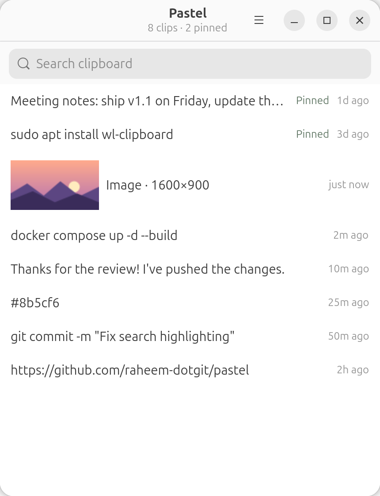

# Pastel: Clipboard History Manager for Linux (Win+V for Ubuntu and GNOME)

[](https://github.com/raheem-dotgit/pastel/releases/latest)
[](https://github.com/raheem-dotgit/pastel/actions/workflows/ci.yml)
[](LICENSE)
[](https://buymeacoffee.com/rahym)

**Pastel** is a fast, lightweight clipboard manager for Linux that works like
**Windows clipboard history (Win+V)**. Press **Super+V** to see everything
you've copied, search it, pin favorites, and paste again. It's a native
GTK4 + libadwaita app written in Rust, built for **Ubuntu**, **GNOME** and
**Wayland**.

<p align="center">
  <picture>
    <source media="(prefers-color-scheme: dark)" srcset="docs/screenshot-dark.png">
    
  </picture>
</p>

## Features

- **Clipboard history on Super+V**, just like Win+V on Windows
- **Text and images**: screenshots and copied images are saved with a preview
- **Instant search**: type to filter, then press Enter to copy
- **Pin clips** so they're never pushed out of the history
- **Hide after copy**: pick a clip, then paste with Ctrl+V
- **Skips passwords** marked secret by password managers such as KeePassXC
- **Native GNOME look** that follows your light/dark system theme
- **Runs in the background**: closing the window keeps Pastel running
- **Starts at login** (optional)
- **Local and private**: history is stored only on your computer
- Small (~600 KB) and fast, written in Rust

## How Pastel compares

| | Pastel | [CopyQ](https://github.com/hluk/CopyQ) | [GPaste](https://github.com/Keruspe/GPaste) | [Clipman](https://github.com/chmouel/clipman) |
|---|---|---|---|---|
| Interface | GTK4 + libadwaita | Qt | GTK 4 app + GNOME Shell extension | none; uses a picker such as wofi |
| Default shortcut to open history | Super+V | configurable | Ctrl+Alt+H | bind it yourself |
| Desktops | GNOME, wlroots (Sway, Hyprland) | Linux, Windows, macOS¹ | GNOME | wlroots (Sway etc.) |
| Records copies while hidden on GNOME | ❌ latest copy only² | ✅ via its Shell extension | ✅ | n/a |

¹ On Wayland, CopyQ monitors the clipboard natively on KDE Plasma and
wlroots, and through a bundled GNOME Shell extension on GNOME
([known issues](https://copyq.readthedocs.io/en/latest/known-issues.html)).
² See [How clipboard capture works](#how-clipboard-capture-works).

## Install

One command, no cloning or compiling:

```bash
curl -fsSL https://raw.githubusercontent.com/raheem-dotgit/pastel/main/install.sh | sh
```

This downloads the latest release to `~/.local/bin/pastel`, adds Pastel to
your app menu, **binds Super+V automatically** on GNOME, and starts it.
To update later, run `pastel update`.

Requirements: Ubuntu 24.04 or newer (or another distro with GTK 4 and
libadwaita), plus `wl-clipboard`:

```bash
sudo apt install wl-clipboard
```

Prefer to download it yourself? Get `pastel-x86_64` or `pastel-aarch64` from
the [latest release](https://github.com/raheem-dotgit/pastel/releases/latest),
make it executable, and run `./pastel install`.

## Usage

| Command | What it does |
|---|---|
| `pastel` | Start Pastel |
| `pastel show` | Open the window (starts Pastel if needed) |
| `pastel quit` | Quit the running instance |
| `pastel install` | Add to the app menu and bind Super+V |
| `pastel update` | Update to the latest release |

| Key | Action |
|---|---|
| `Super+V` | Open Pastel |
| Type | Search clips |
| `↓` / `↑` | Move through the list |
| `Enter` | Copy the selected clip |
| Right-click | Copy, pin/unpin, or delete a clip |
| `Esc` | Clear the search, or hide the window |
| `Ctrl+Q` | Quit |

### About Super+V on GNOME

GNOME uses Super+V to open the notification list by default. `pastel install`
moves that to **Super+M** only, which still works, and gives Super+V to
Pastel. On other desktops, bind `pastel show` to a key in your keyboard
settings.

## How clipboard capture works

- **Sway, Hyprland and other wlroots compositors:** every copy is recorded,
  even while Pastel is hidden (via `wl-paste --watch`).
- **GNOME:** Wayland only reports clipboard changes to the focused window.
  Pastel records copies made while its window is open, plus your latest copy
  each time you open it with Super+V.

Text and images are both recorded. When a copy offers both (for example a
file copied in the file manager), Pastel keeps the text.

## Build from source

```bash
sudo apt install libgtk-4-dev libadwaita-1-dev wl-clipboard
git clone https://github.com/raheem-dotgit/pastel
cd pastel
cargo build --release
./target/release/pastel install
```

## Your data

| File | Purpose |
|---|---|
| `~/.config/pastel/history.json` | Clipboard history |
| `~/.config/pastel/settings.json` | Preferences |
| `~/.config/pastel/images/` | Saved images and thumbnails |

## Uninstall

```bash
pastel quit
rm -f ~/.local/bin/pastel ~/.local/share/applications/pastel.desktop ~/.config/autostart/pastel.desktop
rm -rf ~/.config/pastel
gsettings reset org.gnome.shell.keybindings toggle-message-tray
```

Then remove the Pastel shortcut in **Settings → Keyboard → Custom Shortcuts**.

## FAQ

**How do I get Windows-style clipboard history (Win+V) on Ubuntu?**
Install Pastel with the one-line command above and press Super+V. You get a
searchable list of what you've copied, like Win+V on Windows.

**Does it work on Wayland?**
Yes. On Sway, Hyprland and other wlroots compositors every copy is recorded.
On GNOME, Wayland only lets Pastel see copies while its window is open, plus
your latest copy each time you open it.

**Is there a clipboard manager for GNOME that looks native?**
Pastel is built with GTK4 and libadwaita, so it looks like other GNOME apps
and follows your light/dark system theme.

**Where is my clipboard history stored?**
Locally, in `~/.config/pastel/history.json`, readable only by your user.
Your history never leaves your computer.

**Does it save images?**
Yes. Copied images and screenshots are saved with a thumbnail, and you can
copy them back like any other clip.

**Is it free?**
Yes. Pastel is free and open source under the MIT license.

## Contributing

Contributions are welcome! See [CONTRIBUTING.md](CONTRIBUTING.md).

If Pastel saves you time, you can support its development on
[Buy Me a Coffee](https://buymeacoffee.com/rahym).

## License

[MIT](LICENSE)
